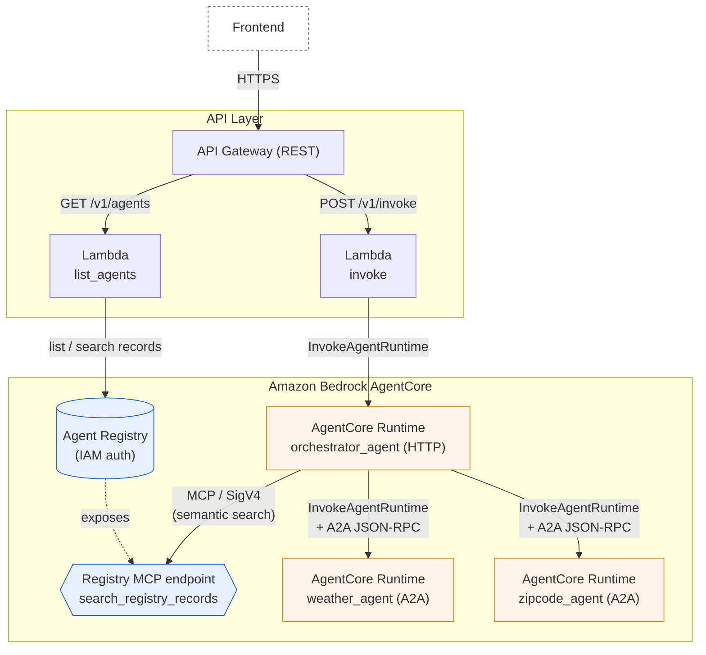

# Agent Orchestration Prototype

AI エージェントのオーケストレーションソリューションのバックエンド プロトタイプ。

## アーキテクチャ



- リージョン: **東京 (ap-northeast-1)**
- IaC: **AWS CDK (TypeScript)**
- エージェント実装: **Python 3.13 + Strands Agents**
- エージェント間プロトコル: **A2A**
- バックエンド窓口: **API Gateway REST + Lambda (Python 3.13)**

## スタック構成

| Stack | 役割 |
|---|---|
| `AgentOrchestrationRegistryStack` | AgentCore Agent Registry を作成（プレビュー API のため Custom Resource 経由） |
| `AgentOrchestrationAgentsStack` | サブエージェント 2 種（天気・郵便番号）と Orchestrator を AgentCore Runtime にデプロイ。サブエージェントは Registry に AGENT レコードとして登録 |
| `AgentOrchestrationApiStack` | API Gateway + 2 つの Lambda |

## ディレクトリ

```
.
├── bin/app.ts                       CDK エントリポイント
├── lib/
│   ├── registry-stack.ts            Agent Registry (Custom Resource)
│   ├── registry-record.ts           AGENT レコード Construct (Custom Resource)
│   ├── agents-stack.ts              AgentCore Runtime × 3
│   └── api-stack.ts                 API Gateway + Lambda
├── agents/
│   ├── orchestrator/                オーケストレーター (HTTP, BedrockAgentCoreApp)
│   ├── weather/                     天気サブエージェント (A2A, Open-Meteo)
│   └── zipcode/                     郵便番号サブエージェント (A2A, zipcloud)
└── lambda/
    ├── list_agents/index.py         GET  /v1/agents
    └── invoke/index.py              POST /v1/invoke
```

## API 仕様

### `GET /v1/agents`
Registry に登録されている全レコードを返す。

```json
{
  "agents": [
    {
      "recordId": "rec-xxxx",
      "recordArn": "arn:aws:bedrock-agentcore:...",
      "name": "weather_agent",
      "description": "天気検索エージェント...",
      "descriptorType": "AGENT",
      "status": "APPROVED",
      "version": "1.0.0"
    }
  ]
}
```

### `GET /v1/agents?name={agentName}`
エージェント名で完全一致フィルタした結果を返す（内部では `search_registry_records` を利用）。

### `POST /v1/invoke`
オーケストレーターに自然言語のリクエストを送信。

```bash
curl -X POST "$API_URL/v1/invoke" \
  -H "Content-Type: application/json" \
  -d '{"prompt": "東京の天気を教えて", "sessionId": "optional-session-id"}'
```

レスポンス:
```json
{
  "sessionId": "...",
  "result": { "result": "東京は晴れ、気温は ..." }
}
```

## デプロイ

前提:
- AWS CLI 認証情報が東京リージョン向けに設定済み
- Docker が稼働している（CDK の `DockerImageAsset` が `linux/arm64` で AgentCore 用イメージをビルド）
- Agent Registry プレビュー API のため、Custom Resource Lambda は `installLatestAwsSdk: true` で最新 boto3 (≥ 1.42.91) を取得
- Bedrock のモデル `global.anthropic.claude-sonnet-4-6`（または `ORCHESTRATOR_MODEL_ID` env で指定する任意の代替）が東京リージョンで利用可能であること

```bash
# 依存インストール
npm install

# CDK ブートストラップ（リージョン初回のみ）
npx cdk bootstrap aws://<ACCOUNT_ID>/ap-northeast-1

# デプロイ（依存順に自動）
npx cdk deploy --all
```

デプロイ後、`AgentOrchestrationApiStack.ApiUrl` 出力に API のベース URL が表示される。

## 設計上の補足

### Agent Registry が CFN 未対応である件
プレビュー段階のため、`AWS::BedrockAgentCore::Registry` / `RegistryRecord` リソースは未提供。
本プロトタイプでは [`AwsCustomResource`](https://docs.aws.amazon.com/cdk/api/v2/docs/aws-cdk-lib.custom_resources.AwsCustomResource.html) で `bedrock-agentcore-control` API を直接呼び出している。
GA でリソース提供されたら、Custom Resource を CFN 標準リソースに差し替えるだけで済む構造。

### サブエージェントの発見方法
オーケストレーター起動時に Registry を `search_registry_records` で検索し、`descriptorType: AGENT` のレコードから A2A エージェントカード (`descriptors.agent.card.inlineContent`) を取得。
カードに含まれる `url` を `A2AClientToolProvider(known_agent_urls=[...])` に渡してツール化し、Strands Agent のツールとして LLM がディスパッチを判断する。
→ 新しいサブエージェントを Registry に APPROVED 状態で追加するだけで、オーケストレーターが自動的に認識する設計。

### プロトコル選択
- オーケストレーター: **HTTP** (`ProtocolConfiguration: HTTP`) — API Gateway / Lambda から `invoke_agent_runtime` で呼ばれるため
- サブエージェント: **A2A** (`ProtocolConfiguration: A2A`) — 要件通り、オーケストレーター ↔ サブ間は A2A

### IAM ロール
プロトタイプとして 3 つの Runtime で 1 つのロールを共有。本番運用ではサブエージェントごとに最小権限を分離することを推奨。

## ローカル開発／動作確認

サブエージェント単体をローカル起動:
```bash
cd agents/weather
pip install -r requirements.txt
python app.py   # http://localhost:9000/.well-known/agent-card.json
```

## 既知の制約 / TODO

- `RegistryStack` の Custom Resource は更新フロー未対応（プロパティ変更時は手動再作成）
- Lambda → AgentCore Runtime のレスポンスはストリーミング非対応（単一 JSON）
- 認証未実装（API Gateway は public）— 本番では Cognito / IAM / API Key を想定

## 参考

- [AWS Agent Registry プレビュー解説 (Classmethod)](https://dev.classmethod.jp/articles/aws-agent-registry-preview/)
- [Get started with AWS Agent Registry (AWS Docs)](https://docs.aws.amazon.com/bedrock-agentcore/latest/devguide/registry-get-started.html)
- [`AWS::BedrockAgentCore::Runtime` (CFN)](https://docs.aws.amazon.com/AWSCloudFormation/latest/TemplateReference/aws-resource-bedrockagentcore-runtime.html)
- [Strands Agents A2A docs](https://strandsagents.com/docs/user-guide/concepts/multi-agent/agent-to-agent/)
